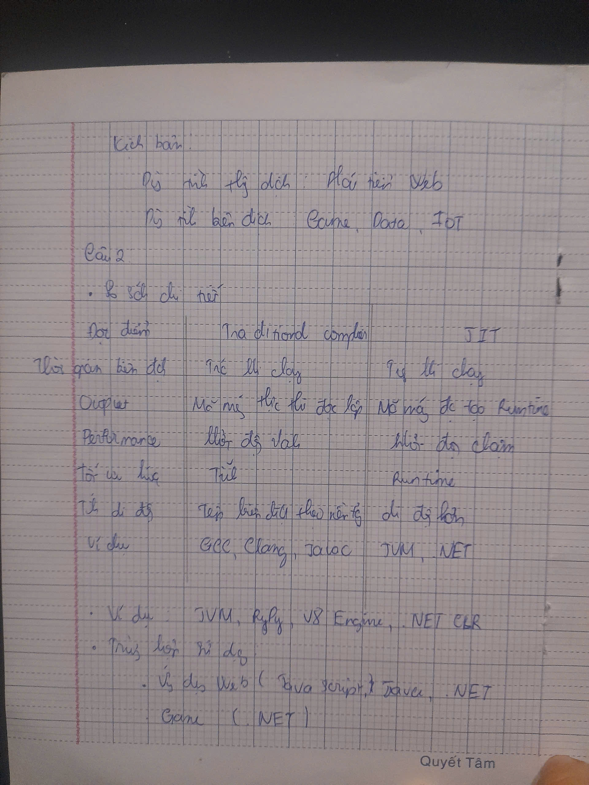
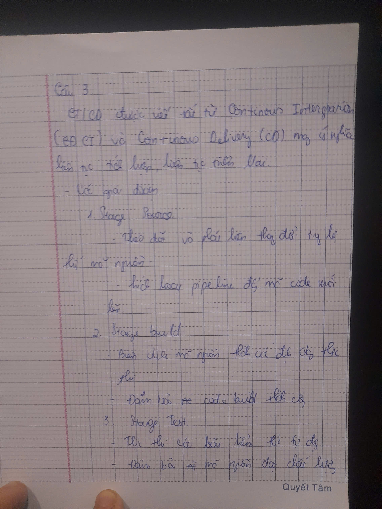
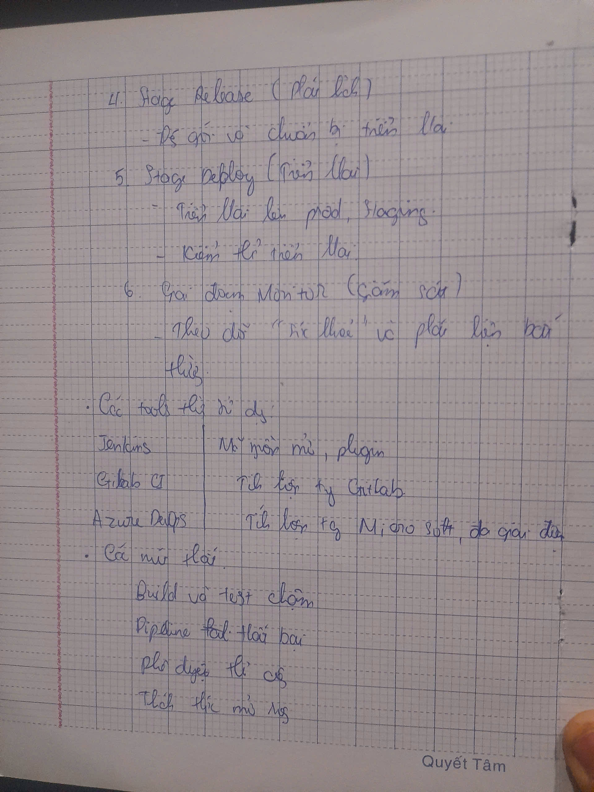
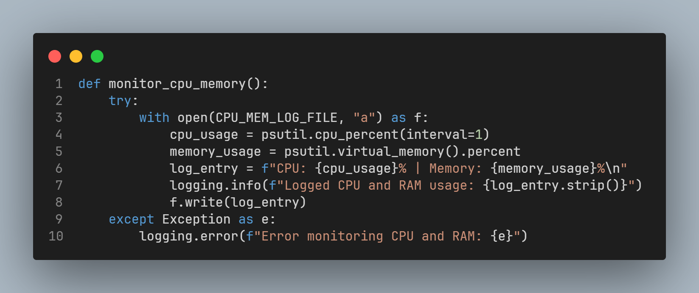
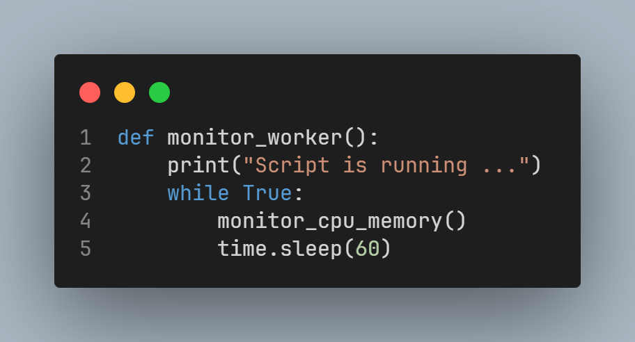
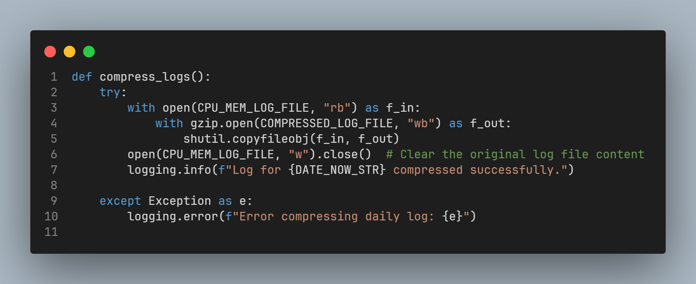
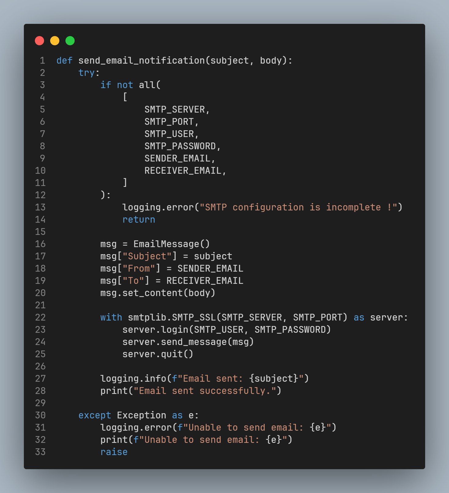
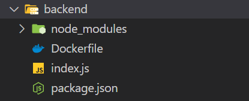
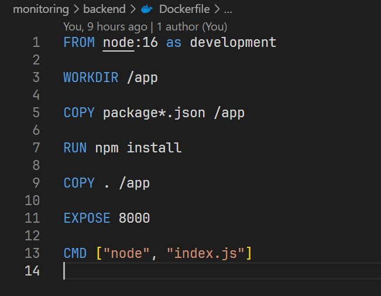
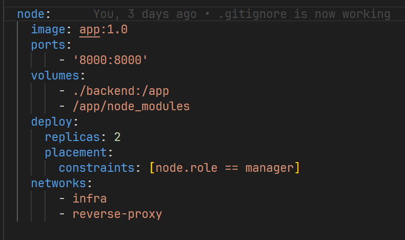

<h1 align="center">Lab Final Assignment</h1>

### Part I: Theory (40%)
```
1. Explain the difference between interpreters and compilers. Provide examples of
programming languages that use interpreters and compilers. Discuss scenarios
where one is preferred over the other.
2. Differentiate between Just-in-Time (JIT) compilers and traditional compilers.
Provide examples of JIT implementations and their use cases.
3. Define CI/CD and its importance in DevOps. Explain the stages of a CI/CD
pipeline. List tools commonly used in CI/CD and compare their features. Discuss
common bottlenecks in CI/CD pipelines and strategies to resolve them.
4. Define cloud computing and its key characteristics (e.g., scalability, elasticity).
Compare IaaS, PaaS, and SaaS with examples. Discuss the benefits of using cloud
computing in DevOps.
5. Compare Docker containers and virtual machines in terms of architecture,
performance, and use cases. List the advantages of using Docker over virtual
machines in a DevOps workflow.
6. Define IaC and its benefits. Explain the role of Terraform in automating
infrastructure. Provide an example use case of Terraform in a DevOps project.
7. Define observability and its importance in a production environment. Explain the
three pillars of observability: logs, metrics, and traces. List tools commonly used
for observability and discuss how they integrate into the DevOps lifecycle
```







---

### Part II: Lab (60%)
```
1. Lab 1 (15%)
Write a Python or Bash script to:
•	Monitor CPU and memory usage of a system.
•	Log the information to a file every minute.
•	Compress the log file daily.
•	Parse and analyze access logs from a web server.
•	Generate insights such as the top 5 IP addresses by request count, most frequently accessed endpoints, and error rates.
•	Automate email notifications if error rates exceed a threshold.
•	Include proper error handling, logging, and parameterization in your script.
```
## Environment Setup

Before running the application, you need to export the following environment variables into your system:

```python
SMTP_SERVER=
SMTP_PORT=
SMTP_USER=
SMTP_PASSWORD=
SENDER_EMAIL=
RECEIVER_EMAIL=
ERROR_RATE_THRESHOLD=
```
Example: 
```python
export SMTP_USER=tranthipr30@gmail.com
```

- Monitor CPU and memory usage of a system



- Log the information to a file every minute.



- Compress the log file daily



- Automate email notifications if error rates exceed a threshold




```
2. Lab 2 (15%)
Create a CI/CD pipeline to deploy a Node.js application using GitHub Actions: https://github.com/arifsetiawan/node-test-sample. The pipeline should include:
•	Code linting and unit tests.
•	Building a Docker image of the application.
•	Deploying the Docker container to a local environment or cloud service.
•	Document the steps to set up and run the pipeline.

3. Lab 3 (15%)
Deploy an application using Docker and Docker Compose.
Use Docker Compose to set up the application and integrate Grafana for observability (https://github.com/arifsetiawan/node-test-sample):
•	Use Grafana Loki for logging.
•	Use Grafana Mimir for metrics.
•	Create dashboards to monitor logs and metrics.
•	Document how to access and use the Grafana dashboards.
```

Before running the application, you need to export the following environment variables into your system:

```python
MINIO_ROOT_USER=
MINIO_ROOT_PASSWORD=
```
Example: 
```python
export MINIO_ROOT_USER=admin
```
We will project structured like that



and content Dockerfile that:



, docker-compose.yml: 




We will use the following command to deploy the application using Docker Swarm:

```bash
docker stack deploy -c docker-compose.yml lemp
```

#### CI/CD Pipeline

The entire CI/CD process is handled by the script `scripts.sh`. This script automates the following tasks:

- **Performs testing** running lint tests using `flake8` for Python code 
- **Builds the Docker images** using the `Dockerfile`.
- **Deploys the application** via Docker Swarm using the `docker-compose.yml` file.

Once the deployment is complete, you can access at:

- nodejs:
  https://app.therops.blog/

- grafana:
  https://monitor.therops.blog/

- loki:
[http://139.180.158.237:3100/](https://loki)

- cadvisor:
[http://139.180.158.237:8088/](https://cadvisor)

- prometheus:
[http://139.180.158.237:9090/](https://prometheus)

- minio:
  https://stored.therops.blog/login

```
user: admin
password: admin123
```

```
4. Lab 4 (15%)
Use Terraform to:
•	Define infrastructure for a Dockerized application.
•	Create at least one container and expose it via a network port.
•	Provide a README.md explaining how to use your Terraform configuration to provision the infrastructure.
```

## Features
- Defines a Docker container for the Minoi (object store).
- Exposes the application on a specified port (9001).
- Dynamically configurable using Terraform variables.
- Easy to destroy and recreate the infrastructure.

---
## Prerequisites

Before you begin, ensure you have the following installed:

1. **Docker**: [Docker Installation Guide](https://docs.docker.com/get-docker/)
2. **Terraform**: [Terraform Installation Guide](https://www.terraform.io/downloads)
3. **Minio** [Minio Installation Guide](https://min.io/)

---

## Directory Structure

```
CYBERSKILL/
├── terraform/
│   ├── main.tf
│   ├── variables.tf
│   ├── outputs.tf
│   └── README.md

```

---

## Terraform Files

### `main.tf`
This file contains the core Terraform configuration, including provider setup, Docker image, and container resource definitions.

### `variables.tf`
Defines input variables to make the configuration dynamic and customizable.

---

## How to Use


### Step 1: Initialize Terraform
Run the following command to initialize Terraform and download the necessary providers:
```bash
terraform init
```

### Step 2: Plan the Configuration
Ensure the Terraform configuration is valid:
```bash
terraform plan
```

### Step 3: Apply the Configuration
Apply the configuration to create the Docker container:
```bash
terraform apply
```
- When prompted, type `yes` to confirm.

### Step 4: Access Minio
Once the infrastructure is provisioned, access the application using:

https://stored.therops.blog/login

---

## Configurable Variables

The configuration includes variables defined in `variables.tf` that can be adjusted as needed:

| Variable            | Description                               | Default         |
|---------------------|-------------------------------------------|-----------------|
| `MINIO_ROOT_USER`    | user access minio                      | `admin`  |
| `MINIO_ROOT_PASSWORD`          | password of user root             | `****`  |

To override these values, you can create a `terraform.tfvars` file or pass them directly during the `apply` command:

```bash
terraform apply -var "MINIO_ROOT_USER=admin" 
                -var "MINIO_ROOT_PASSWORD=your_secure_password"
```

---

## Outputs

After running `terraform apply`, the following outputs will be displayed:

| Output              | Description                               |
|---------------------|-------------------------------------------|
| `container_name`    | Name of the Docker container             |
| `container_ports`   | Port mappings of the container           |
| `container_status`  | Status of the container                  |

---

## Cleanup

To destroy the infrastructure and clean up resources:
```bash
terraform destroy
```
- Confirm by typing `yes` when prompted.

---


---

## Troubleshooting

1. **Docker Daemon Issues:**
   - Ensure the Docker daemon is running on your system.
   - Check the Docker host configuration in `main.tf`.

2. **Port Conflicts:**
   - Verify that the host port (`9001` by default) is not already in use.
   - Modify the `external` variable (in main.tf) if needed. 

---
